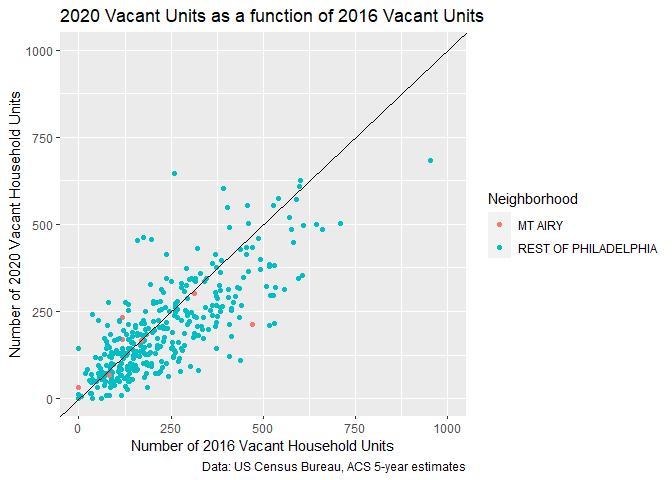
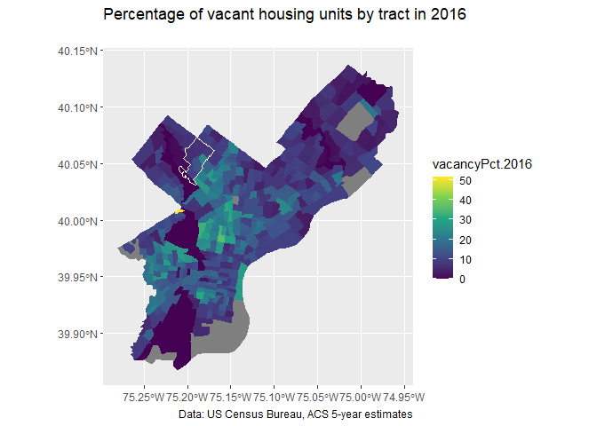

# Import Libraries


```r
library(tidyverse)
library(tidycensus)
library(sf)
```

# Census API Key


```r
census_api_key("4b917a3ebce557bc497aebb5aba1b04f0ff9c5ba", overwrite = TRUE)
```

# Downloading Data from Tidycensus

## Create a vector of census variables


```r
acs_vars <- c("B01001_001E", # ACS total Pop estimate
              "B25002_001E", # Estimate of total housing units
              "B25002_003E", # Number of vacant housing units
              "B19013_001E", # Median HH Income ($)
              "B02001_002E", # People describing themselves as "white alone"
              "B06009_006E") # Total graduate or professional degree
```

## Download 2016 data without geoms


```r
acsTractsPHL.2016 <- get_acs(geography = "tract",
                             year = 2016, 
                             variables = acs_vars,
                             geometry = FALSE,
                             state = "PA", 
                             county = "Philadelphia",
                             output = "wide") %>%
  dplyr::select (GEOID, NAME, all_of(acs_vars)) %>% 
  rename (total_pop.2016 = B01001_001E,
          total_HU.2016 = B25002_001E,
          total_vacant.2016 = B25002_003E,
          med_HH_Income.2016 = B19013_001E,
          total_White.2016 = B02001_002E,
          total_GradDeg.2016 = B06009_006E) %>%
  mutate(vacancyPct.2016 = (total_vacant.2016/total_HU.2016) * 100,
         pctWhite.2016 = total_White.2016/total_pop.2016)
```

## Download 2020 data with geoms


```r
acsTractsPHL.2020.sf <- get_acs(geography = "tract",
                             year = 2020, 
                             variables = acs_vars, 
                             geometry = TRUE, 
                             state = "PA", 
                             county = "Philadelphia", 
                             output = "wide") %>% 
  dplyr::select (GEOID, NAME, all_of(acs_vars)) %>%
  rename (total_pop.2020 = B01001_001E,
          total_HU.2020 = B25002_001E,
          total_vacant.2020 = B25002_003E,
          med_HH_Income.2020 = B19013_001E,
          total_White.2020 = B02001_002E,
          total_GradDeg.2020 = B06009_006E) %>%
  mutate(vacancyPct.2020 = (total_vacant.2020/total_HU.2020) * 100,
         pctWhite.2020 = total_White.2020/total_pop.2020) %>%
  st_as_sf(crs = 4326) # Turn shp into sf object and project as WGS84
```


# Process Data

## Join data


```r
allACS <- left_join(acsTractsPHL.2020.sf, acsTractsPHL.2016,
                    by= c("GEOID"))
```

## Create a new variable called myTracts


```r
myTracts <- c("42101023500", 
              "42101023600", 
              "42101023700", 
              "42101025300", 
              "42101025400",
              "42101025500", 
              "42101025600", 
              "42101038800")

allACS <- allACS %>%
  mutate(Neighborhood = ifelse(GEOID %in% myTracts, "MT AIRY", "REST OF PHILADELPHIA"))
```


# Homework Assignments

## Plot 2016 Vacancy compared to 2020

The plot shows that the number of vacant housing units per census unit has increased in some parts of Philadelphia and decreased in others - in Mt. Airy the number of vacant housing units has increased or stayed roughly the same in all census tracts except for one census tract.


```r
ggplot(allACS)+
  geom_point(aes(x =total_vacant.2016, 
                 y = total_vacant.2020,
                 color = Neighborhood))+
  xlim(0,1000)+ #Add x limits to make graph easier to read (both are the same)
  ylim(0,1000)+ #Add y limits to make graph easier to read (both are the same)
  geom_abline(intercept = 0, slope = 1)+
  labs(
    title = "2020 Vacant Units as a function of 2016 Vacant Units",
    caption = "Data: US Census Bureau, ACS 5-year estimates",
    x="Number of 2016 Vacant Household Units", 
    y="Number of 2020 Vacant Household Units")
```

<!-- -->

## Map - vacant hosuehold units in 2016 as a precent of total housing units


```r
acsTractsPHL.2016.sf <- get_acs(geography = "tract",
                             year = 2016, 
                             variables = acs_vars, 
                             geometry = TRUE, 
                             state = "PA", 
                             county = "Philadelphia", 
                             output = "wide") %>% 
  dplyr::select (GEOID, NAME, all_of(acs_vars)) %>%
  rename (total_pop.2016 = B01001_001E,
          total_HU.2016 = B25002_001E,
          total_vacant.2016 = B25002_003E,
          med_HH_Income.2016 = B19013_001E,
          total_White.2016 = B02001_002E,
          total_GradDeg.2016 = B06009_006E) %>%
  mutate(vacancyPct.2016 = (total_vacant.2016/total_HU.2016) * 100,
         pctWhite.2016 = total_White.2016/total_pop.2016,
         Neighborhood = ifelse(GEOID %in% myTracts, "MT AIRY", "REST OF PHILADELPHIA")) %>%
  st_as_sf(crs = 4326) # Turn shp into sf object and project as WGS84
```


The percent vacancy rate in 2016 in Mt Airy varies between 0 and 23 percent with the lowest vacancy rates located in the Northern and far Southwestern areas of the neighborhood, the highest vacancy rates are in the South central areas of Mt. Airy.


```r
ggplot()+
  geom_sf(data = acsTractsPHL.2016.sf, aes(fill = vacancyPct.2016),
          color = "transparent")+
  geom_sf(data = allACS %>%
            filter(Neighborhood == "MT AIRY") %>%
            st_union(),
          color = "white",
          fill = "transparent")+
  scale_fill_viridis_c() + #Use color scheme from viridis
  labs(
    title = "Percentage of vacant housing units by tract in 2016",
    subtitle = "",
    caption = "Data: US Census Bureau, ACS 5-year estimates")
```

<!-- -->

## Create the Kable table

The average number of vacant housing units per census tract in Mt.Airy is 157, the average number of vacant housing units per census tract in the Rest of Philadelphia is 167; thus the number of vacant housing units per census tract is lower in Mt.Airy than the rest of Philadelphia.


```r
allACS %>%
  st_drop_geometry() %>%
  group_by(Neighborhood) %>%
  summarize(Mean_Vacant_HU = round(mean(total_vacant.2020, na.rm = TRUE),0)) %>%
  kbl(col.names = c('Neighborhood','Average Number of Vacant Housing Units')) %>%
  kable_classic()
```

<table class=" lightable-classic" style='font-family: "Arial Narrow", "Source Sans Pro", sans-serif; margin-left: auto; margin-right: auto;'>
 <thead>
  <tr>
   <th style="text-align:left;"> Neighborhood </th>
   <th style="text-align:right;"> Average Number of Vacant Housing Units </th>
  </tr>
 </thead>
<tbody>
  <tr>
   <td style="text-align:left;"> MT AIRY </td>
   <td style="text-align:right;"> 157 </td>
  </tr>
  <tr>
   <td style="text-align:left;"> REST OF PHILADELPHIA </td>
   <td style="text-align:right;"> 187 </td>
  </tr>
</tbody>
</table>
